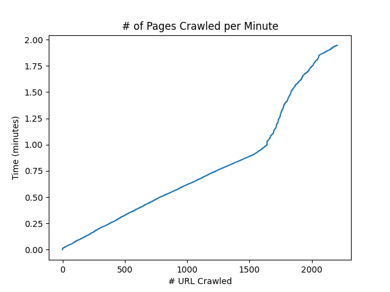
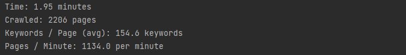

# Scrapy Web Crawler

### Installation
1. Install Python 3.x
2. Install scrapy [here](https://docs.scrapy.org/en/latest/intro/install.html)
3. Install any other libraries required
4. Run ```__init__.py```

### Pros
* Relatively quick (x pages per minute)
* Stores most keywords from every page
* Normalizes keywords by making them all lower case, getting rid of characters that aren't alphanumeric
* Never scrapes the same url twice.
* Doesn't stop running if we reach a malfunctioning page


### Cons
* Misses some keywords that have weird formatting
* Lack of stemming
* Indexing keywords would be inefficient for searching (no order and a lot)
* Doesn't prioritize titles and headers as keywords
* Only uses one spider which will limit speed

### Crawl Statistics and Plots




### Lessons Learned
